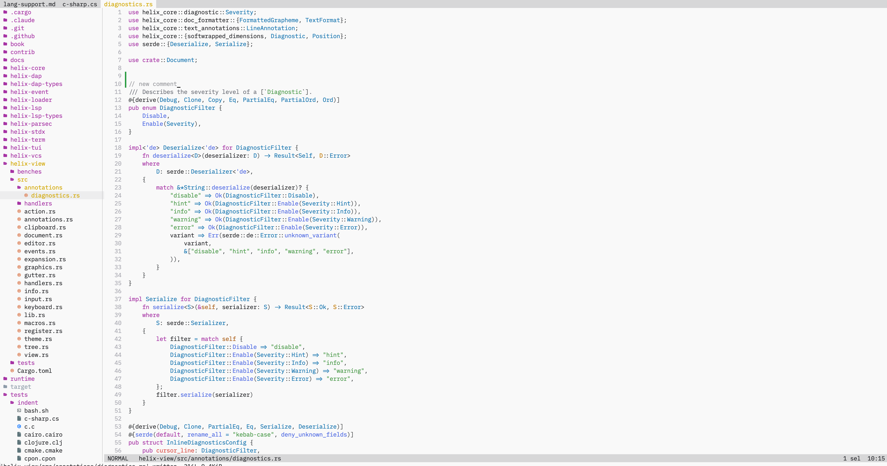
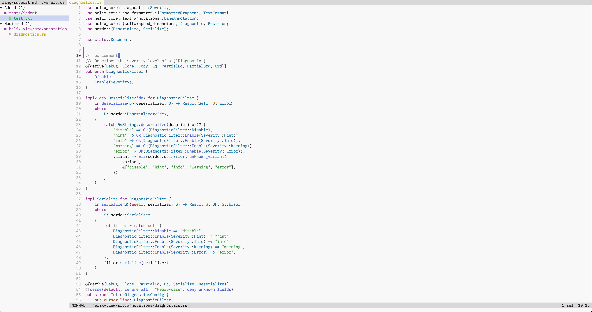

<div align="center">

<h1>helix-chad</h1>

A fork of [Helix](https://github.com/helix-editor/helix) with two sidebars and richer git integration.

</div>

---

helix-chad is [Helix](https://github.com/helix-editor/helix) — the modal terminal editor written in Rust — plus a few IDE-like touches:

- 📂 **File explorer** sidebar with folder icons
- 🌿 **Git changes** sidebar
- 🎨 **Git status colors** on files, folders, and buffer titles

Everything else (editing model, language support, configuration) is standard Helix — see the [Helix docs](https://docs.helix-editor.com/).

## Features

**File explorer** — browse and edit the file tree (nvim-tree style).
- Nerd Font folder icons instead of expand triangles.
- Git status colors per file, propagated up to parent folders (VSCode style).
- Create (`a`), rename (`r`), delete (`d`) files from the sidebar.




> **Note:** the folder icons require a [Nerd Font](https://www.nerdfonts.com/) in your terminal. Without one, the icons show up as tofu (□).

**Git changes** — list of changed files (Zed style).
- A `Staged` group plus Added / Modified / Deleted groups for the unstaged changes, with counts.
- Single-child folder chains are collapsed into one line (`src/routes/api.export`).
- Enter opens the file in the editor.
- Stage / unstage (`s`) and discard (`d`) a change directly from the sidebar.




## Keybindings

| Key | Action |
|---|---|
| `Ctrl-e` | Toggle the file explorer |
| `Space e` | Focus the explorer on the current file |
| `Space g` | Toggle the git changes sidebar |

Inside a sidebar:

| Key | Action |
|---|---|
| `j` / `k` | Move up / down |
| `l` / `Enter` | Expand folder or open file |
| `h` | Collapse / go to parent |
| `Ctrl-→` / `Ctrl-←` | Widen / narrow the sidebar (both sidebars stay the same width) |
| `R` | Reload |
| `q` / `Esc` | Return focus to the editor |

The two sidebars are mutually exclusive. `Space` and `:` still work while a sidebar is focused, so you can switch between them or run commands without leaving.

## Git colors

Themeable, with these defaults:

| Status | Theme key | Color |
|---|---|---|
| Added | `version_control.added` | `#27A657` |
| Modified | `version_control.modified` | `#D3B020` |
| Deleted | `version_control.deleted` | `#E06C76` |

## Install

```sh
cargo install --path helix-term --locked
```

See the [Helix install docs](https://docs.helix-editor.com/install.html) for prerequisites. Folder icons require a [Nerd Font](https://www.nerdfonts.com/) in your terminal.

## Credits

A fork of [Helix](https://github.com/helix-editor/helix). Thanks to the Helix community. ❤️
